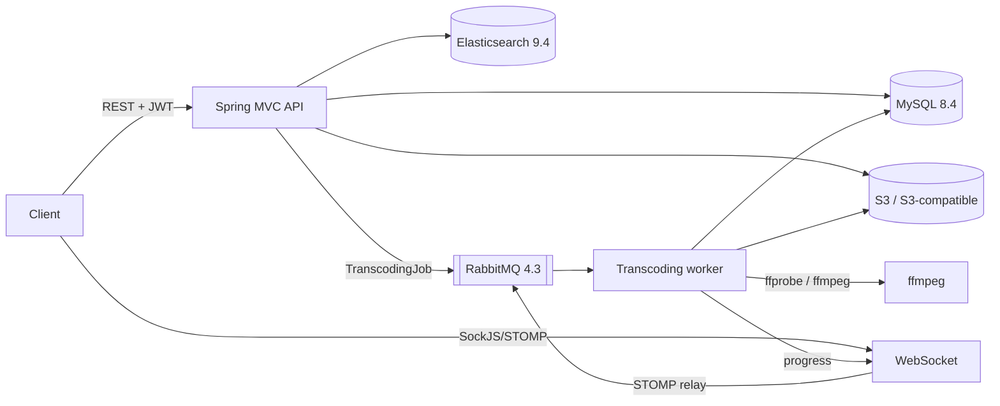

# DIYnCrafts backend

REST backend for a platform where DIY enthusiasts share project videos and written guides. It handles
accounts, video upload and adaptive-streaming transcoding (MPEG-DASH), full-text video search,
guides, categories with view statistics, an editor's pick, and live transcoding progress over
WebSocket. The React/Vite frontend lives in a separate repository (expected at `http://localhost:5173`).

> **Security notice — action required.** Earlier revisions of this repository committed real
> credentials (an AWS access key pair, the JWT signing secret, the MySQL root password and the
> Elasticsearch password). They have been removed from the working tree but **remain in Git
> history**. Removing them from the code does not make them safe. See
> [Manual actions](#manual-actions-for-operators).

## Architecture

A single Spring Boot application (a modular monolith). The code is organised by layer under
`com.diyncrafts.web.app`:

| Package | Responsibility |
|---|---|
| `controller` | REST endpoints; request validation; no business logic |
| `service` | Use cases (auth, videos, uploads, guides, categories, search indexing) |
| `transcoding` | RabbitMQ worker, ffmpeg command building/execution, task state machine |
| `storage` | S3 object storage, object key scheme, image validation |
| `search` | Elasticsearch query construction and index bootstrap |
| `security` | Spring Security configuration, JWT issuing, ownership checks |
| `model`, `repository` | JPA entities / Spring Data repositories (+ the Elasticsearch document) |
| `dto` | Request/response types; entities never leave the service layer |



Stack: Java 17+, Spring Boot 4.1 (Spring Framework 7, Spring Security 7, Hibernate 7), Flyway,
Spring Data Elasticsearch, Spring AMQP, AWS SDK v2 (S3), Maven.

## Prerequisites

| Tool | Version | Needed for |
|---|---|---|
| JDK | 17 or newer | building and running |
| Docker + Docker Compose | recent | local dependencies and integration tests |
| ffmpeg + ffprobe | 6.x or newer on `PATH` | transcoding (and the real-ffmpeg tests) |

Maven is provided by the wrapper (`./mvnw`). Install ffmpeg with `apt install ffmpeg`,
`brew install ffmpeg` or `winget install ffmpeg`.

## Required services

| Service | Purpose | Local (docker-compose) |
|---|---|---|
| MySQL 8.4 | primary database (schema managed by Flyway) | `localhost:3306` |
| Elasticsearch 9.4 | video search (derived data, rebuildable) | `localhost:9200` |
| RabbitMQ 4.3 with `rabbitmq_stomp` | transcoding jobs; WebSocket relay | `5672`, STOMP `61613`, UI `15672` |
| S3 or S3-compatible storage | thumbnails, guide images, DASH output | Adobe S3Mock on `localhost:9090` |

## Configuration

All settings live in `src/main/resources/application.yml`, and **no credentials are stored there**.
Supply secrets as environment variables; Spring maps names automatically
(`SPRING_DATASOURCE_PASSWORD` → `spring.datasource.password`). `.env.example` lists them all.

| Variable | Required | Description |
|---|---|---|
| `APP_JWT_SECRET` | **yes** | HS256 signing key, ≥ 32 characters (`openssl rand -base64 48`). Startup fails without it. |
| `SPRING_DATASOURCE_URL` / `_USERNAME` / `_PASSWORD` | yes (prod) | MySQL connection |
| `SPRING_RABBITMQ_HOST` / `_USERNAME` / `_PASSWORD` | yes (prod) | RabbitMQ connection |
| `SPRING_ELASTICSEARCH_URIS` / `_USERNAME` / `_PASSWORD` | yes (prod) | Elasticsearch; use `https://` in production |
| `APP_STORAGE_BUCKET`, `APP_STORAGE_REGION` | yes (prod) | S3 bucket and region |
| `APP_STORAGE_ENDPOINT`, `APP_STORAGE_PATH_STYLE_ACCESS` | no | S3-compatible services (MinIO, S3Mock, ...) |
| `APP_STORAGE_PUBLIC_BASE_URL` | no | Base URL for stored objects, e.g. a CDN (default: bucket URL) |
| AWS credentials | yes (prod) | Standard AWS provider chain: instance/task role (recommended), `AWS_PROFILE`, or `AWS_ACCESS_KEY_ID`/`AWS_SECRET_ACCESS_KEY` |
| `APP_CORS_ALLOWED_ORIGINS` | no | Browser origins (default `http://localhost:5173`) |
| `APP_TRANSCODING_ENCODER` | no | `libx264` (default) or `h264_nvenc` |
| `APP_TRANSCODING_WORK_DIR` | no | Scratch directory for uploads and ffmpeg output |
| `APP_TRANSCODING_TIMEOUT` | no | ffmpeg time limit (default `25m`; keep it below RabbitMQ's `consumer_timeout`) |
| `APP_WEBSOCKET_RELAY_ENABLED` | no | Relay STOMP through RabbitMQ (needed with more than one instance) |
| `APP_BOOTSTRAP_ADMIN_USERNAME` / `_PASSWORD` / `_EMAIL` | no | Create the first admin at startup (see below) |

Profiles:

- **default**: production-style. Every connection comes from the environment.
- **`local`**: points at `docker-compose.yml` (`src/main/resources/application-local.yml`).
- **`test`**: H2 plus mocks, used by the test suite (`src/test/resources/application-test.yml`).

For production Elasticsearch over TLS with a private CA, configure an SSL bundle
(`spring.ssl.bundle.*`) and reference it via `spring.elasticsearch.restclient.ssl.bundle`. Never
disable certificate verification.

## Running locally

```bash
docker compose up -d                          # MySQL, Elasticsearch, RabbitMQ (+STOMP), S3Mock

export APP_JWT_SECRET="$(openssl rand -base64 48)"
export AWS_ACCESS_KEY_ID=local AWS_SECRET_ACCESS_KEY=local   # S3Mock ignores them; the SDK needs some
export APP_BOOTSTRAP_ADMIN_USERNAME=admin APP_BOOTSTRAP_ADMIN_PASSWORD='change-me-please' \
       APP_BOOTSTRAP_ADMIN_EMAIL=admin@example.com            # optional

./mvnw spring-boot:run -Dspring-boot.run.profiles=local
```

The API listens on `http://localhost:8080`. `GET /actuator/health` reports `UP` when every
dependency is reachable. On first start Flyway creates the schema and seeds the default categories,
and the search index is created.

Quick check:

```bash
curl -s -H 'Content-Type: application/json' \
  -d '{"username":"alice","password":"alice-password","email":"alice@example.com"}' \
  localhost:8080/api/auth/register
TOKEN=$(curl -s -H 'Content-Type: application/json' -d '{"username":"alice","password":"alice-password"}' \
  localhost:8080/api/auth/login | jq -r .token)
curl -s -H "Authorization: Bearer $TOKEN" -F videoFile=@clip.mp4 -F title=Birdhouse \
  -F description='Cedar birdhouse' -F difficultyLevel=Beginner -F category=Woodworking \
  localhost:8080/api/videos/upload
```

Stop the dependencies with `docker compose down` (add `-v` to delete their data).

## Testing

```bash
./mvnw test      # unit + API tests: H2 and mocks, no Docker, no credentials (~30 s)
./mvnw verify    # additionally runs *IT integration tests with Testcontainers (Docker required)
```

- **Unit/API tests** cover:
  - Security: 401/403, roles, forged/expired tokens, registration privilege escalation.
  - Ownership, response serialization (no password hashes or emails), validation and error codes.
  - Guides, pagination, category statistics, uploads, storage keys, search query construction.
  - Transcoding: command building, ffprobe parsing, progress, worker failure and cleanup behaviour.
- **Real-ffmpeg tests** transcode generated clips (landscape with audio, portrait without audio, 4:3,
  corrupt input, timeout). They are skipped automatically when `ffmpeg` is not on `PATH`.
- **Integration tests** (`src/test/java/.../it`) cover:
  - Flyway migrations on MySQL 8.4, including upgrading a legacy database with data.
  - The application on MySQL with `ddl-auto=validate`.
  - Search against Elasticsearch 9.4.
  - The transcoding pipeline through RabbitMQ 4.3: delivery, retries, dead-lettering.

CI (`.github/workflows/ci.yml`) installs ffmpeg and runs `./mvnw verify` on every push and pull request.
It also checks the deployment files (ShellCheck, Compose, Caddyfile), and builds and scans the image
(Trivy: fixable HIGH/CRITICAL fail the build). On `main`, it publishes the image to GHCR by digest.

## Deployment

The production image and the deployment stack live in this repository:

- **Image**: `Dockerfile` (multi-stage). Maven build, then the Temurin 17 JRE on Ubuntu 24.04 with
  distribution `ffmpeg`/`ffprobe` (libx264, AAC, NVENC-capable). It runs as UID 10001 with a
  read-only application directory, has a readiness `HEALTHCHECK`, and passes shutdown signals
  straight to the JVM. `docker build -t diyncrafts-backend .` needs nothing but Docker.
- **Published images**: `ghcr.io/rcgchandu/diyncrafts:sha-<commit>`, with an SBOM and provenance
  attached. Deployments always use the digest (`…@sha256:…`), never a moving tag.
- **Runtime roles** (same image, chosen by profile):
  - `SPRING_PROFILES_ACTIVE=prod,api`: HTTP and WebSocket, uploads, Flyway migrations; no job
    consumer. Graceful shutdown lets in-flight requests finish (2 min).
  - `SPRING_PROFILES_ACTIVE=prod,worker`: consumes transcoding jobs. On shutdown it stops taking jobs
    and finishes the running one (up to 30 min). No Flyway.
  - No role profile (local development): one process does both.

  Separate roles need `APP_WEBSOCKET_RELAY_ENABLED=true` (RabbitMQ STOMP) and a **shared scratch
  volume** for `APP_TRANSCODING_WORK_DIR`, because uploads are handed to the worker through it.
- **Health**: `/actuator/health/liveness`, `/actuator/health/readiness`, and `/actuator/info`
  (includes the commit). `prod` also exposes `/actuator/prometheus` for the internal network only.
  The edge proxy never routes `/actuator`.
- **Scratch storage**: uploads are refused with 503 when accepting one would leave less than
  `APP_TRANSCODING_MIN_FREE_SPACE` (default 2 GB) free.
- **Logs**: `prod` writes one JSON object per line (ECS), with version, environment and `taskId`.
- **Stack**: `deploy/`. A single Docker host with the Caddy edge (HTTPS, `/`, `/api`, `/ws`, 2 GiB
  uploads), blue/green API and workers, and managed or optional on-host MySQL, RabbitMQ and
  Elasticsearch. The Deploy workflow deploys to staging after every green `main`. Production is an
  approved promotion of the staging digests.

Read next: [architecture and decisions](docs/deployment/ARCHITECTURE.md),
[environments and secrets](docs/deployment/ENVIRONMENTS.md), [runbook](docs/deployment/RUNBOOK.md),
[release checklist](docs/deployment/RELEASE_CHECKLIST.md).

## Video pipeline

1. `POST /api/videos/upload` (multipart) validates the metadata and the optional thumbnail. The
   thumbnail is checked by magic bytes: JPEG, PNG or WebP only.
2. It stores the thumbnail in S3, saves the video to `{workDir}/{taskId}/input`, and creates the video
   and a `QUEUED` task in one short transaction.
3. It publishes a `TranscodingJob` to the quorum queue `diyncrafts.transcoding`.
4. The worker moves the task to `PROCESSING`, probes the file with ffprobe, and runs one ffmpeg
   command that produces a DASH ladder:
   - 1080/720/480/360 on the short side, never upscaled, aspect ratio and rotation preserved.
   - An AAC audio track only if the source has audio.
   - Key frames aligned to segments.
5. Progress is parsed from `-progress pipe:1`, stored on the task, and pushed to
   `/topic/progress-{taskId}` (`{taskId, progress, status}`).
6. If no thumbnail was uploaded, one is extracted with ffmpeg.
7. Output is uploaded to `videos/{taskId}/…`, the video's `videoUrl` is set to the manifest URL, and
   the task becomes `COMPLETED`.
8. **Failures:**
   - Bad input, an ffmpeg error or a timeout fails the task immediately, with a user-safe
     `errorDetails`.
   - Infrastructure errors (S3, database) are retried twice with backoff; after that the task is
     `FAILED` and the message goes to `diyncrafts.transcoding.dlq`.
   - The broker dead-letters a message after 3 deliveries, so crashes can't loop forever.
   - A watchdog fails tasks stuck in `PROCESSING`.
   - Redelivered jobs for finished tasks are ignored.
9. **Cleanup:** the task's work directory is deleted when the task is `COMPLETED` or `FAILED`. It is
   kept between retries, which need the input.

Poll `GET /api/videos/status/{taskId}` (owner or admin) or subscribe to the progress topic.
`videoUrl` is `null` until transcoding completes.

### ffmpeg and GPU acceleration

The worker needs `ffmpeg` and `ffprobe` (configurable via `app.transcoding.ffmpeg-path` and
`ffprobe-path`). The default encoder is **`libx264` on the CPU**, which works on every machine.
Encoding time grows with resolution and length. Keep `app.transcoding.timeout` below RabbitMQ's
`consumer_timeout`, which is 30 min by default; `docker/rabbitmq/rabbitmq.conf` raises it to 2 h for
local use.

On NVIDIA hosts, set `APP_TRANSCODING_ENCODER=h264_nvenc` (optionally `APP_TRANSCODING_PRESET`, default
`p5`). This needs an NVIDIA driver and an ffmpeg build with NVENC; check with
`ffmpeg -hide_banner -encoders | grep nvenc`. The listener runs one job per instance; scale by adding
instances.

## Authentication and authorization

- `POST /api/auth/register` creates an account with role **`ROLE_USER`**. Clients cannot choose a role;
  a `role` field in the request is ignored.
- `POST /api/auth/login` returns `{token, username, email, role}`.
- `POST /api/auth/admin/login` does the same but only for admins (403 otherwise). Failed logins return
  401 with a generic message.
- The token is an HS256 JWT (issuer `diyncrafts`, 1 h lifetime) whose `roles` claim becomes the
  request's authorities. Send it as `Authorization: Bearer <token>`.
- **Admins:** set `APP_BOOTSTRAP_ADMIN_*` to create the first admin at startup. It never promotes an
  existing account. Further admins can be created by updating `user_account.role`.
- Authorization happens server-side in three layers:
  1. URL rules in `SecurityConfig` decide which endpoints are public.
  2. `@PreAuthorize("hasRole('ADMIN')")` guards admin operations.
  3. `AccessGuard` enforces *owner or admin* on video and guide updates and deletes, and on task status.
- Errors use RFC 9457 `application/problem+json`, with 400/401/403/404/409/413/503 as appropriate.
  Validation errors include an `errors` array.

## API overview

There is no generated OpenAPI document yet. Endpoints (✓ = public, 🔑 = authenticated, 👑 = admin,
👤 = owner or admin):

| Method & path | Access | Notes |
|---|---|---|
| `POST /api/auth/register`, `/login`, `/admin/login` | ✓ | JSON |
| `GET/PUT /api/user/profile` | 🔑 | own profile incl. email; `PUT ?mailId=` |
| `GET /api/videos` | ✓ | paged (`page`, `size`≤100, `sort` on id/title/uploadDate/viewCount) |
| `GET /api/videos/{id}`, `/trending`, `/category/{name}`, `/difficulty/{level}` | ✓ | |
| `GET /api/videos/user` | 🔑 | own videos |
| `POST /api/videos/upload` (and legacy `/api/videos/create/`) | 🔑 | multipart: `videoFile`, `title`, `description`, `difficultyLevel`, optional `category`, `materialsUsed`, `thumbnailFile` |
| `PUT /api/videos/{id}` | 👤 | multipart metadata (+ optional `thumbnailFile`); no video re-upload |
| `DELETE /api/videos/{id}` | 👤 | also deletes the video's guides |
| `POST /api/videos/{id}/log-view` | ✓ | |
| `GET /api/videos/status/{taskId}` | 👤 | transcoding task |
| `GET /api/videos/search/{title,text,category,difficulty,material,user}/{value}` | ✓ | `page`, `size` |
| `GET /api/videos/search/filters?searchText&category&difficulty&material` | ✓ | all filters combined |
| `GET /api/videos/search/advanced?searchText&category&minDifficulty` | ✓ | `minDifficulty` is an exact match |
| `GET /api/guides`, `/api/guides/{id}`, `/api/guides/video/{videoId}` | ✓ | `page` (1-based), `size` |
| `GET /api/guides/user` | 🔑 | |
| `POST /api/guides` | 🔑 | JSON `{title, content, videoId}` |
| `PUT /api/guides/{id}`, `DELETE /api/guides/{id}` | 👤 | PUT is multipart (+ optional `imageFile`) |
| `GET /api/categories` | ✓ | |
| `GET /api/categories/stats` | 🔑 | lifetime views and 15-day growth |
| `POST/PUT/DELETE /api/categories[/{id}]` | 👑 | |
| `GET /api/editor-pick` / `POST /api/editor-pick?videoId=` | ✓ / 👑 | |
| `POST /api/admin/search/reindex` | 👑 | rebuild the search index from MySQL |
| `GET /actuator/health[/liveness,/readiness]`, `/actuator/info` | ✓ | no details exposed |
| WebSocket `/ws` (SockJS), topic `/topic/progress-{taskId}` | ✓ | |

## Manual actions for operators

These cannot be done by code changes and must be done by someone with access:

1. **Rotate every previously committed credential.**
   - Deactivate and delete the AWS access key that was in `application.properties`, and review
     CloudTrail for misuse.
   - Change the MySQL `root` password and the Elasticsearch `elastic` password.
   - Generate a new JWT secret. This invalidates all existing tokens, which is intended.
2. **Optionally purge the secrets from Git history** (e.g. `git filter-repo`) and force-push. This
   rewrites published history and needs coordination with everyone who has a clone. Rotation is
   mandatory either way.
3. **Before the first deployment of this version, back up the database.**
   - Flyway adopts an existing database as version 1 (`baseline-on-migrate`), then applies V2–V6:
     - Drops the unique index on `guide.user_id`.
     - Adds `task.video_id`.
     - Makes the media URL columns nullable.
     - Adds `video_daily_views`.
     - Seeds any missing categories.
   - No data is deleted.
   - Hibernate no longer changes the schema (`ddl-auto=validate`).
4. **RabbitMQ:**
   - Jobs now use `diyncrafts.transcoding` and `diyncrafts.transcoding.dlq`. The old
     `transcoding.queue` is no longer consumed: let it drain before upgrading, or delete it.
   - Enable the `rabbitmq_stomp` plugin if you use the WebSocket relay.
   - Make sure `consumer_timeout` exceeds `app.transcoding.timeout`.
5. **Elasticsearch:**
   - The index is now `videos_v2`, with explicit mappings. After deploying, call
     `POST /api/admin/search/reindex` as an admin.
   - The old `videos` index can then be deleted.
6. The application needs ffmpeg/ffprobe on the host or in the container image. The repository's
   `Dockerfile` includes them; Spring Boot's `build-image` does not.

## Compatibility notes for API clients

- Nested `user` objects contain only `{id, username}`: no password hash, email or authorities. The
  full profile is available at `/api/user/profile`.
- Responses are DTOs. `GET /api/videos` returns `{content, number, size, totalElements, totalPages,
  numberOfElements, first, last, empty}`. The previous `pageable` and `sort` objects are gone.
- Guides embed `video` as `{id, title, thumbnailUrl}`, and task status no longer exposes `inputPath`.
- A video's `videoUrl` (and, briefly, `thumbnailUrl`) is `null` until processing completes, instead of a
  broken URL.
- Status codes are now meaningful:
  - Failed logins return 401 (was 400); non-admin admin-login returns 403.
  - Missing resources return 404, duplicates and in-use categories return 409.
  - Validation errors return 400 with details; storage or search outages return 503.
- Creating a category or a guide returns `201 Created`.
- `PUT /api/videos/{id}` no longer requires `videoFile`, and `materialsUsed` can be set on upload and edit.
- Search endpoints accept `page` and `size`, and filters are case-insensitive exact matches.
- Progress messages gained a `status` field.

## Troubleshooting

| Symptom | Cause / fix |
|---|---|
| Startup fails: `app.jwt.secret ... must not be blank` / `at least 32 characters` | Set `APP_JWT_SECRET`. |
| `Schema-validation: missing column/table` | The database is behind the entities; check the Flyway log (`flyway_schema_history`). |
| `/actuator/health` is `DOWN`/`OUT_OF_SERVICE` | A dependency is unreachable or unhealthy. For Elasticsearch, check `curl localhost:9200/_cluster/health`; a red cluster on a nearly full disk is caused by disk watermarks (the local compose file disables them). |
| Search endpoints return 503 | Elasticsearch unreachable. Writes still succeed; run the reindex endpoint once it is back. |
| Upload returns 503 | RabbitMQ unreachable; the task is marked `FAILED` and must be uploaded again. |
| Task `FAILED`: "The video could not be processed." | ffmpeg rejected the file. See the server log for ffmpeg's output (logged at WARN). |
| Task `FAILED`: "Processing took too long…" | Raise `APP_TRANSCODING_TIMEOUT` (and RabbitMQ `consumer_timeout`), or use NVENC. |
| Task stays `QUEUED` | No worker is consuming: check RabbitMQ connectivity and the `diyncrafts.transcoding` queue in the management UI. |
| Messages in `diyncrafts.transcoding.dlq` | Retries were exhausted (the task was marked `FAILED`). Inspect them in the management UI, then purge. |
| `IOException: Cannot run program "ffmpeg"` | Install ffmpeg or set `APP_TRANSCODING_FFMPEG_PATH` / `APP_TRANSCODING_FFPROBE_PATH`. |
| No WebSocket progress | With `app.websocket.relay.enabled=true` the `rabbitmq_stomp` plugin must be enabled (port 61613). Check that the browser origin is in `APP_CORS_ALLOWED_ORIGINS`. |
