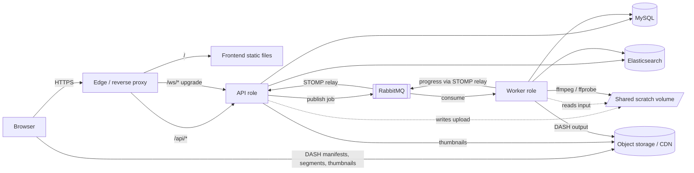

# Deployment architecture

This document records the deployment audit (P0), the target architecture and the decisions behind it.
Operational procedures are in [RUNBOOK.md](RUNBOOK.md); environments and configuration in
[ENVIRONMENTS.md](ENVIRONMENTS.md); the release checklist in [RELEASE_CHECKLIST.md](RELEASE_CHECKLIST.md).

Audited at backend `RCGCHANDU/diyncrafts@d5aa2f6` and frontend `RCGCHANDU/diyncrafts-frontend@1a493fb`.

## 1. Current deployment state (before this work)

**Backend** (Java 17, Spring Boot 4.1.1, Maven wrapper):

- `docker-compose.yml` runs **local development dependencies only** (MySQL 8.4, Elasticsearch 9.4.5,
  RabbitMQ 4.3 with the STOMP plugin, Adobe S3Mock), with throwaway credentials.
- `.github/workflows/ci.yml` runs `./mvnw -B verify` (unit, API and Testcontainers integration
  tests, real-ffmpeg tests). No image is built or published.
- No Dockerfile, no `.dockerignore`, no production configuration, no deployment automation, no
  infrastructure as code, no Kubernetes/Helm/Terraform files.
- Health: Actuator `health` and `info` are exposed and public. Liveness/readiness probes are enabled
  (`/actuator/health/liveness`, `/actuator/health/readiness`).
- Graceful HTTP shutdown is Spring Boot 4.1's default (`server.shutdown=graceful`, 30 s per phase).
- Flyway owns the schema (`ddl-auto=validate`, `baseline-on-migrate`).

**Frontend** (React 19, TypeScript, Vite 8, npm). The mission brief described an older baseline;
the actual `main` after PR #1 differs:

- It already has GitHub Actions CI: type-check, lint, format, Vitest, build, `npm audit`, Playwright.
- The README is project-specific, not the Vite starter.
- Public build-time configuration exists: `VITE_API_BASE_URL` and `VITE_WS_URL`, empty by default
  (same origin). `localhost` only appears in the **dev-server proxy** (`DEV_BACKEND_URL`).
- There is no axios; HTTP goes through `src/api/client.ts`. WebSockets use STOMP over the raw
  WebSocket transport `/ws/websocket`.
- There is no Dockerfile, static-server configuration, published artifact or deployment automation.

## 2. Deployment inventory

| Item | Backend | Frontend |
|---|---|---|
| Build | `./mvnw -B verify` (tests), `./mvnw -B -DskipTests package` → `target/webapp-*.jar` | `npm ci && npm run build` → `dist/` |
| Runtime | `java -jar` (JDK/JRE 17), plus `ffmpeg`/`ffprobe` on `PATH` | Static files, no runtime server required |
| Ports | 8080 (HTTP, REST + SockJS/WebSocket `/ws`) | None (any static host) |
| Health | `/actuator/health/liveness`, `/actuator/health/readiness`, `/actuator/info` | `GET /` and SPA fallback |
| Dependencies | MySQL, Elasticsearch, RabbitMQ (AMQP 5672, STOMP 61613 when relay on), S3 | Backend `/api` and `/ws` |
| Migrations | Flyway at startup (`db/migration`, V1–V6) | — |
| Persistent data | none on the instance | none |
| Temporary data | `app.transcoding.work-dir/{taskId}/{input,output}`; multipart temp files (servlet temp dir) | — |
| Queues | `diyncrafts.transcoding` (quorum, delivery limit 3) and `diyncrafts.transcoding.dlq`, declared by the app | — |
| Object storage | Thumbnails, guide images and DASH output under `videos/{taskId}/`; served to browsers directly (`app.storage.public-base-url`) | — |
| External network | S3 API, RabbitMQ, Elasticsearch, MySQL; no other egress | Browser → site origin (+ media origin) |
| Frontend API config | — | same-origin `/api`, `/ws/websocket` by default |

**Secrets:**

- `APP_JWT_SECRET`
- `SPRING_DATASOURCE_USERNAME` / `_PASSWORD`
- `SPRING_RABBITMQ_USERNAME` / `_PASSWORD` (also used by the STOMP relay)
- `SPRING_ELASTICSEARCH_USERNAME` / `_PASSWORD`
- AWS credentials when no workload identity is available
- `APP_BOOTSTRAP_ADMIN_PASSWORD` (first start only)

The frontend has no secrets; all `VITE_*` values are public.

### Classification

| Component | Purpose | Class | Production preference |
|---|---|---|---|
| Frontend | React SPA (static files) | stateless | Static hosting/CDN; or the provided Nginx image |
| API role | REST + WebSocket/STOMP; receives uploads | stateless *except* upload scratch (see §4) | Container |
| Worker role | RabbitMQ consumer running ffmpeg | ephemeral scratch only | Container on the same host as the API (§4) |
| MySQL | Primary data, Flyway schema | **stateful, irreplaceable** | Managed service (automated backups, PITR) |
| Object storage | Media and images | **stateful, irreplaceable** | Managed S3 (or S3-compatible) |
| Elasticsearch | Search index | stateful but **derived**: rebuilt from MySQL via `POST /api/admin/search/reindex` | Managed, or a small dedicated node |
| RabbitMQ | Transcoding jobs; STOMP relay | stateful but transient: in-flight jobs only (task state lives in MySQL) | Managed (e.g. Amazon MQ, CloudAMQP) or a dedicated node |
| Reverse proxy | TLS, routing, limits | stateless (certificates in its own volume) | Caddy (provided) or a cloud load balancer |

## 3. Runtime dependency graph (current application)



## 4. Findings that shape the design

1. **Uploads are handed from the API to the worker through local disk.** `VideoUploadService`
   writes the file to `{workDir}/{taskId}/input` and stores that absolute path on the task. The worker
   later reads the same path. Any API instance and any worker must therefore **share the same scratch
   filesystem**. That means one host, or a shared volume. Separating them onto different hosts
   requires direct-to-object-storage input (Stage 5).
2. **Role separation needs no code changes.** `spring.rabbitmq.listener.simple.auto-startup`
   (a standard Boot property) switches the consumer off in the API role. The same image serves both
   roles.
3. **Progress messages need the STOMP relay when roles are separated.** The worker publishes progress
   through `SimpMessagingTemplate`. With the in-memory broker, subscribers connected to *another*
   process never receive it. `APP_WEBSOCKET_RELAY_ENABLED=true` (RabbitMQ `rabbitmq_stomp`) is
   mandatory as soon as there is more than one process.
4. **Worker draining.** Spring AMQP's listener container waits only 5 s for an in-flight message on
   shutdown, and Boot has no property for it. The Spring lifecycle phase timeout is 30 s. Without a
   change, a routine restart abandons the running ffmpeg job. It is redelivered, but that consumes one
   of the 3 deliveries and repeats the work. This work adds `app.transcoding.shutdown-timeout`
   (applied through a `ContainerCustomizer`). The worker role raises the lifecycle phase timeout to
   match.
5. **Retry safety already exists.** The input is kept until a terminal state, and `start()` is
   idempotent for non-terminal tasks. Terminal tasks ignore redelivery. The broker dead-letters after
   3 deliveries. `StaleTaskWatchdog` fails tasks stuck longer than 2× the timeout.
6. **Upload size.** Spring multipart allows 2 GB. Every layer in front must allow the same (Tomcat
   imposes no further body limit on multipart). Multipart parts are first written to the servlet temp
   directory and then moved to the work directory. Both must be on the same volume, or every upload is
   copied once more.
7. **No disk guard.** A few large uploads can fill the scratch disk, and the first signal would be
   `No space left on device`. This work adds a free-space check before an upload is accepted, and a
   disk-space metric.
8. **No metrics endpoint and no version information.** `/actuator/info` is empty and there are no
   Prometheus metrics. This work adds build/revision info and Prometheus metrics, including transcoding
   job counters and durations.
9. **Forwarded headers are not trusted** (`server.forward-headers-strategy` is unset). Behind a
   proxy, the app sees the proxy's scheme and address. The production profile enables `native`, which
   Tomcat's `RemoteIpValve` limits to private-network proxies.

## 5. Gaps

| Area | Gaps found |
|---|---|
| Security | No hardened image: nothing ran as non-root because nothing was containerized. No image or dependency scanning. No SBOM. No security headers or CSP at the edge. No documented secret-store usage. Actions pinned by major tag only. |
| Reliability | No worker drain (5 s). No disk guard. No documented migration ordering, rollback or backup/restore. Single-process roles make a long ffmpeg job compete with HTTP traffic for CPU. |
| Automation | No image build, publish, staging or promotion. The frontend had no deployable artifact. |
| Scalability | The API cannot be scaled across hosts because of the local-disk handoff (finding 1). Workers cannot be scaled separately yet. |
| Observability | No metrics, no version info, no alerts, no transcoding SLO signals. |
| Documentation | No production, operations or recovery documentation. |

## 6. Target architecture (Stage 2–3: first production deployment)

```text
Users ──HTTPS──▶ Caddy (edge: TLS, HTTP→HTTPS, limits, headers)          ─┐
                   ├── /           → frontend  (Nginx, static, non-root)  │  one Docker host
                   ├── /api/*      → api-blue | api-green (same image)    │  (VM), Compose
                   └── /ws/*       → api-blue | api-green                 │
                                     worker-blue | worker-green (same image, consumer role)
                                     shared volume /var/lib/diyncrafts  ─┘
Managed / dedicated services (outside the host): MySQL · RabbitMQ (+stomp) · Elasticsearch · S3
Browsers load video media directly from S3 or a CDN in front of it (never through Spring).
```

- **One immutable backend image** runs as the `api` role (HTTP, Flyway, no consumer) or the `worker`
  role (consumer, long drain, no Flyway, no public traffic).
- **One immutable frontend image** (Nginx), or the same `dist/` uploaded to static hosting.
- **Blue/green on one host**: Caddy load-balances over both colours with an active readiness check.
  A deploy starts the idle colour and waits for readiness. Only then does the old colour stop
  gracefully. Rollback redeploys the previous digest the same way.
- Stateful services are **external** (managed preferred). For staging or a very small production, an
  optional `compose.stateful.yaml` runs them on the host with persistent volumes and authentication.
  It is deliberately kept in a separate file.

## 7. Decisions

| Decision | Reason | Alternatives considered | Why not selected |
|---|---|---|---|
| **No Kubernetes** | One application with two runtime roles. A handful of containers. No multi-team ownership, no evidence of frequent horizontal scaling, and uploads require a shared local volume (finding 1). | Kubernetes / Helm | The cluster's operational cost exceeds the app's needs. A shared volume across nodes would need RWX storage. |
| **Reference platform: one Docker host with Compose** (Option B) plus managed stateful services | Cheapest, understandable, portable. Matches finding 1. Blue/green works without extra infrastructure. | Managed container platform (ECS/Cloud Run/Container Apps; Options A/C) | The upload handoff needs a shared filesystem. Cloud Run has no shared writable disk; ECS/Container Apps need EFS/Azure Files. It becomes a good option after direct-to-S3 uploads (Stage 5). The images are portable to it unchanged. |
| **Provider-neutral artifacts, no cloud IaC yet** | No cloud provider, domain or budget has been specified. | Terraform for AWS/GCP/Azure | Would invent infrastructure. `infra/<provider>/` is reserved for when a target is chosen. |
| **Deployment definitions live in `deploy/` in the backend repo** | The backend owns the stateful dependencies and most runtime configuration; one team. | A third "infra" repository | Access control and ownership are the same; a separate repository adds coordination for no benefit today. |
| **Frontend: static artifact first, Nginx image as the portable fallback** | Vite SPA, no server-side rendering. The same `dist/` can go to a CDN or the image. | Node server; Next.js | No server-side requirement; migrating frameworks for deployment is not justified. |
| **Backend image: multi-stage Maven → Temurin 17 JRE (Ubuntu 24.04) + distro ffmpeg** | ffmpeg 6.1 with libx264 is built in, from a maintained distribution. Glibc base. Non-root. Layered Spring Boot jar. | Alpine/distroless | Distroless cannot `apt install` ffmpeg. Alpine's musl and ffmpeg builds differ from CI. A static ffmpeg download has no update channel. |
| **Same image, two roles** (API / worker) via Spring profiles | Isolates ffmpeg CPU from HTTP. Workers drain independently. Uses a standard Boot property. | Keep the single process; split the codebase | A single process is kept as the default for local development. A codebase split is a microservice rewrite. |
| **Migrations: Strategy A with a single migrator** | Only the API role runs Flyway (at startup, before readiness). Workers have `spring.flyway.enabled=false` and start after the API is ready. `ddl-auto=validate` makes a worker refuse a schema it does not match. | Dedicated migration job | Adds a moving part without need at this scale. Documented as the next step if migrations become long-running. |
| **Edge: Caddy** | Automatic HTTPS (ACME), WebSocket proxying without extra configuration, explicit body limits and timeouts, active health checks for blue/green. | Nginx; cloud load balancer | Nginx needs certbot plumbing. A cloud LB is provider-specific; documented as a drop-in replacement. |
| **Registry: GHCR** | Same place as the source. `GITHUB_TOKEN` authentication (short-lived), no extra account. | Docker Hub, ECR/GAR/ACR | No provider chosen. Images can be mirrored if the platform requires it. |
| **CI/CD: build once on `main`, promote by digest** | The image digest built and scanned in CI is the one deployed to staging and later production. | Rebuild per environment | Rebuilding gives non-identical artifacts. |
| **Deploy transport: SSH with a forced-command key** | Works for any VM. The key can only run `diyncrafts-deploy`, with a validated image reference. | Cloud OIDC roles | There is no cloud API in the reference target. When one is chosen, use GitHub OIDC federation (see ENVIRONMENTS.md). |
| **Staging deploys automatically; production is manual, approved and promoted** | Production receives exactly the digests currently verified in staging. | Continuous deployment to production | Not an intentional choice today; can be enabled later. |
| **Secrets as files read by Spring's `configtree`** (`/etc/diyncrafts/secrets/backend/<property>`) | Never in images, Compose files, workflow YAML or `docker inspect` environment. Works with any secret manager that can write files. | Environment variables in an `.env` file; Docker Swarm secrets | Env files leak through `docker inspect` and process listings; Swarm is not used. |
| **Image scanning with Trivy (pinned by digest), fixable HIGH/CRITICAL fail CI** | Found real issues during this work (Tomcat, amqp-client, libexpat), all fixed rather than ignored. Exceptions need a reason and a review date in `.trivyignore`. | Scanning only in the registry; Dependabot alone | Too late (after publish) or too slow (weekly). |
| **Actions pinned by commit SHA**, Dependabot for updates | Tags can be moved by whoever controls the action's repository. | Major-version tags | Supply-chain risk for workflows that hold publish and deploy credentials. |
| **Edge runs non-root with only `NET_BIND_SERVICE`**; all containers have read-only root filesystems, `cap_drop: ALL` and `no-new-privileges` | Limits the blast radius of a compromised process. | Defaults | — |
| **Frontend deploys go through the backend repository's Deploy workflow** | One place holds deployment credentials and the host's forced-command key. | Separate deploy workflow and SSH key in the frontend repository | Twice the credentials to protect and rotate. |

## 8. Maturity path

1. **Development consistency** (done): local Compose, CI, production images, environment docs.
2. **First production deployment**: Compose reference stack, managed MySQL/S3, managed or dedicated
   RabbitMQ/Elasticsearch, HTTPS. The stack is provided and was verified on a single machine.
   *Running it for real requires an operator to provision a host and services (see §10).*
3. **Reliable CD** (implemented in workflows): immutable digests, staging, smoke tests, approved
   promotion, rollback. *Takes effect once the GitHub environments are configured
   (ENVIRONMENTS.md).*
4. **Operational maturity**: Prometheus metrics and alert rules (provided and unit-tested),
   backup/restore drills (scripts provided and exercised), resource tuning from real measurements.
5. **Scale when needed**, in order:
   - direct-to-S3 multipart uploads (removes the shared-disk constraint);
   - worker autoscaling on queue depth/age;
   - GPU workers (`APP_TRANSCODING_ENCODER=h264_nvenc` on NVIDIA hosts);
   - a managed container platform.

## 9. Cost drivers

In rough order for a small deployment:

1. **Elasticsearch** (managed clusters are the most expensive idle component).
2. **Transcoding CPU**, or GPU when chosen.
3. **Managed MySQL**.
4. **Video storage and egress** (egress grows with viewing; a CDN reduces origin cost).
5. **Managed RabbitMQ**.
6. **Load balancers** (avoided by using Caddy on the host).

Elasticsearch is kept because search needs relevance ranking and exact filters over title,
description and materials (`VideoSearchQueries`). For a small catalogue, a single small node (managed
basic tier, or self-hosted with 1–2 GB heap) is sufficient. Revisit if search usage stays low.

## 10. Open decisions for the owner

Nothing in this repository assumes a cloud provider, domain, budget or traffic volume. What this work
provides is provider-neutral: images, the Compose stack, scripts and workflows. Only these
decisions are needed before a first real deployment:

| Decision | Options | Effect |
|---|---|---|
| Where the host runs | Any VM provider or on-premises | Set `DEPLOY_HOST`; nothing else changes. |
| Managed data services | Provider-managed MySQL, broker and search, or `compose.stateful.yaml` on the host (staging, very small production) | `backend.env` values. |
| Object storage and CDN | S3 or S3-compatible, plus a CDN | `APP_STORAGE_*`, `MEDIA_ORIGIN`, bucket CORS. |
| Domain | — | `SITE_ADDRESS`, `APP_CORS_ALLOWED_ORIGINS`, DNS records. |
| Alert delivery | Email, chat, paging | Alertmanager receivers. |
| Infrastructure as code | Terraform or OpenTofu for the chosen provider, in `infra/<provider>/` | Reproducible hosts and services; add once a provider is chosen. |

## 11. Verification record

Verified on one machine with the production images, the Compose stack, on-host stateful services
and an S3 mock (`deploy/test/`). This was **not** a real staging or production environment, and
nothing has been deployed to one.

| What | Result |
|---|---|
| `./mvnw -B verify` | 96 unit/API tests and 17 Testcontainers integration tests pass |
| Backend image | Non-root (10001), ffmpeg 6.1 with libx264/AAC/NVENC, no source or secrets inside; Trivy: no fixable HIGH/CRITICAL |
| Frontend image | Non-root (101), read-only root filesystem; SPA fallback, immutable assets, missing assets 404 (not cached), CSP and security headers |
| Frontend image scan | One HIGH (libexpat in the nginx base). Fixed by `apk upgrade` at build time. **Not verified here**, because the Alpine mirrors are unreachable from the verification machine. CI's scan gate enforces it. |
| Edge | HTTPS (local CA), HTTP→HTTPS redirect, `/actuator` 404, 413 above the upload limit and above 1 MiB elsewhere, WebSocket upgrade, cross-origin WebSocket refused (403), no tokens or query strings in access logs |
| Browser journey through the edge | Register, upload, transcoding in the separate worker, live progress over the STOMP relay, media fetched from the media origin (CORS scoped), search, no CSP violations. DASH output decodes as H.264/AAC (ffprobe). Playback itself could not be observed, because the test browser lacks H.264 codecs. |
| Blue/green under load | 842 requests during a backend switch, all 200; 376 during a frontend deploy and rollback, all 200 |
| Worker drain | A 90-second 1080p job running on the old worker completed there after the switch; the new worker never received it |
| Failure handling | An image that never becomes healthy aborts the deploy (exit 3) while the old version keeps serving; rollback takes about a minute; tags and foreign repositories are refused |
| SSH forced command | Only `deploy`, `rollback` and `status` with validated arguments; injection attempts refused |
| Backup | Consistent dump (on-host and remote mode), checksum, restore test into a throwaway container |
| Alerts | `promtool check rules` and `promtool test rules` pass; metric names checked against a running instance |
| Workflows | actionlint (with ShellCheck) passes. They have **not run on GitHub yet** |
